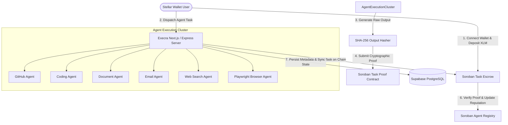
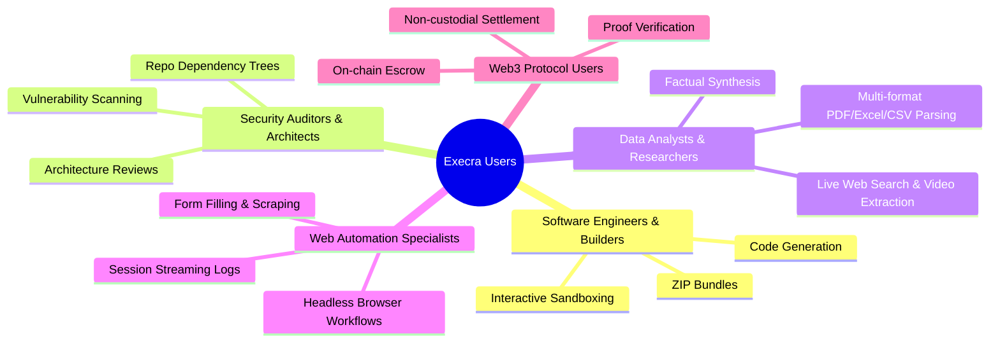
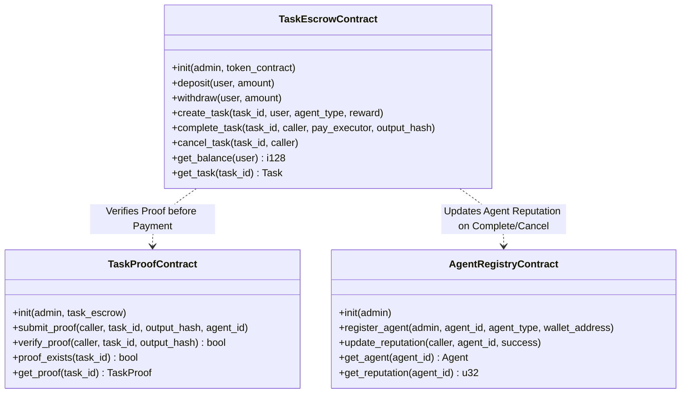
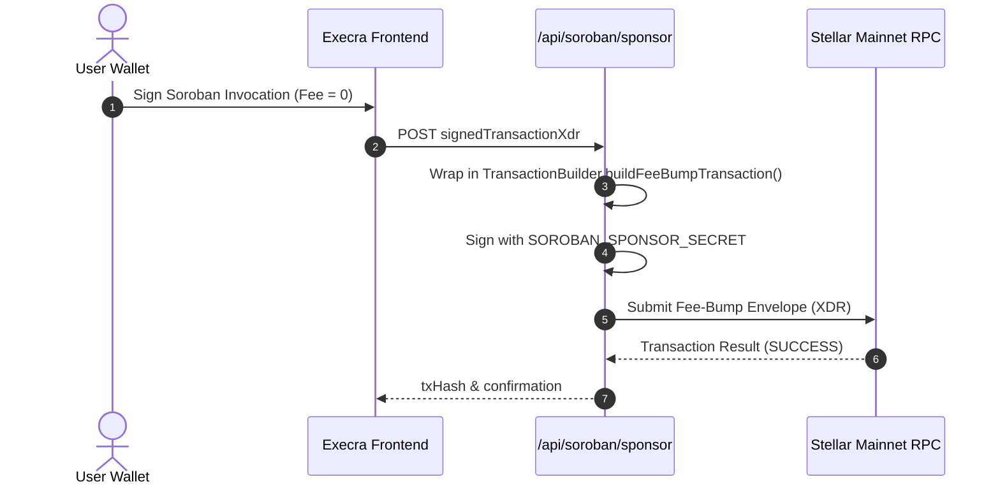
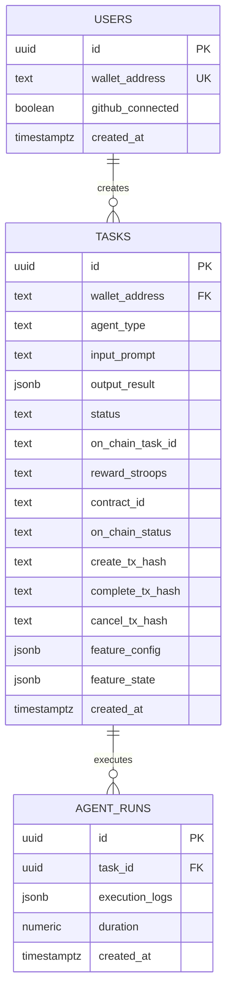
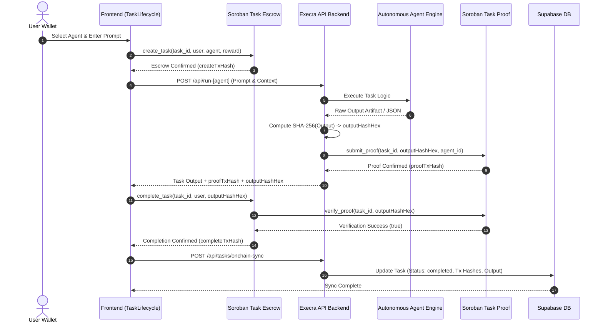

# Execra — Complete System Documentation & Architecture Specification

> **Wallet-First Multi-Agent Autonomous Workspace on Stellar & Soroban**  
> **Official Live Deployment:** [execra6.vercel.app](https://execra6.vercel.app)  
> **Network:** Stellar Mainnet (Protocol 20+ Soroban Smart Contracts)  
> **Repository:** `anuraggdubey/Execra6`

---

## Table of Contents

1. [Executive Summary & System Manifesto](#1-executive-summary--system-manifesto)
2. [Target Audience & User Personas](#2-target-audience--user-personas)
3. [Autonomous Multi-Agent Suite](#3-autonomous-multi-agent-suite)
   - [3.1 GitHub Agent](#31-github-agent)
   - [3.2 Coding Agent](#32-coding-agent)
   - [3.3 Document Analysis Agent](#33-document-analysis-agent)
   - [3.4 Email Dispatch Agent](#34-email-dispatch-agent)
   - [3.5 Web Search & Video Agent](#35-web-search--video-agent)
   - [3.6 Live Browser Automation Agent](#36-live-browser-automation-agent)
   - [3.7 Agent Comparison Matrix](#37-agent-comparison-matrix)
4. [High-Level Architecture & Repository Topology](#4-high-level-architecture--repository-topology)
5. [Smart Contract Architecture (Soroban & Rust)](#5-smart-contract-architecture-soroban--rust)
   - [5.1 Task Escrow Contract (`task_escrow`)](#51-task-escrow-contract-task_escrow)
   - [5.2 Task Proof Contract (`task_proof`)](#52-task-proof-contract-task_proof)
   - [5.3 Agent Registry Contract (`agent_registry`)](#53-agent-registry-contract-agent_registry)
   - [5.4 Soroban State & TTL Management](#54-soroban-state--ttl-management)
6. [Stellar Mainnet Operations & Wallet Engine](#6-stellar-mainnet-operations--wallet-engine)
   - [6.1 Mainnet Network Parameters & Deployed Addresses](#61-mainnet-network-parameters--deployed-addresses)
   - [6.2 Wallet Connectors (Freighter, xBull, Albedo)](#62-wallet-connectors-freighter-xbull-albedo)
   - [6.3 Fee Sponsorship & Fee-Bump Relayer](#63-fee-sponsorship--fee-bump-relayer)
7. [Backend Architecture, APIs & LLM Orchestration](#7-backend-architecture-apis--llm-orchestration)
   - [7.1 Express + Next.js 16 Hybrid Server (`server.mjs`)](#71-express--nextjs-16-hybrid-server-servermjs)
   - [7.2 Next.js API Routes & Endpoints](#72-nextjs-api-routes--endpoints)
   - [7.3 LLM Gateway & OpenRouter Integration](#73-llm-gateway--openrouter-integration)
   - [7.4 Server-Side Playwright Engine](#74-server-side-playwright-engine)
8. [Database Architecture & Data Persistence (Supabase / PostgreSQL)](#8-database-architecture--data-persistence-supabase--postgresql)
   - [8.1 Database Entity Schemas](#81-database-entity-schemas)
   - [8.2 Row Level Security (RLS) & Protection Strategy](#82-row-level-security-rls--protection-strategy)
   - [8.3 Feature Flag & Configuration JSONB Payloads](#83-feature-flag--configuration-jsonb-payloads)
9. [End-to-End Cryptographic Task Lifecycle](#9-end-to-end-cryptographic-task-lifecycle)
10. [Security Model, Threat Analysis & Error Handling](#10-security-model-threat-analysis--error-handling)
11. [Local Development, Environment Setup & Deployment Guide](#11-local-development-environment-setup--deployment-guide)

---

## 1. Executive Summary & System Manifesto

**Execra** is a decentralized, wallet-first multi-agent workspace built on **Stellar Mainnet** and powered by **Soroban Smart Contracts**. 

Modern AI agent platforms suffer from two fundamental problems:
1. **Blind trust & pre-payment risk:** Users must deposit funds into opaque off-chain custodial accounts with no guarantee of task delivery or cryptographic proof.
2. **Unverified execution:** Once an agent responds, there is no immutable audit trail proving that the output was generated honestly without tampering or prompt deviation.

Execra solves both problems through **Escrow-Backed Autonomous Execution**:
- **Non-Custodial Escrow:** Every agent task locks funds in a Soroban smart contract on Stellar Mainnet. Funds are held in escrow until verifiable completion.
- **Cryptographic Task Proofs:** When an agent finishes execution, the backend creates a canonical SHA-256 hash of the generated artifact or data, submitting it on-chain to the `task_proof` contract.
- **Atomic Settlement:** The `task_escrow` contract validates that an immutable on-chain proof exists before releasing or settling payments.
- **Multi-Wallet Native Access:** Users authenticate seamlessly using their preferred Stellar wallet (**Freighter**, **xBull**, or **Albedo**) without passwords or seed phrase exposures.
- **Optional Gas Sponsorship:** Deployments can sponsor network fees using Stellar fee-bump transactions (`EnvelopeTypeTxFeeBump`), lowering friction for new web3 users.



---

## 2. Target Audience & User Personas

Execra is engineered to serve five distinct user profiles:



### Persona 1: Web3 Builders & Smart Contract Developers
- **Pain Point:** Context switching between IDEs, documentation, code review tools, and web3 billing.
- **Execra Solution:** Instant GitHub codebase review, rapid full-stack UI MVP generation with live iframe preview, and project ZIP download backed by transparent on-chain payments.

### Persona 2: Security Auditors & Code Reviewers
- **Pain Point:** Manually cloning massive repos, reading complex file trees, and identifying architecture flaws.
- **Execra Solution:** The GitHub Agent securely connects to public or private repos via OAuth, recursively maps file trees (filtering out `node_modules` and binaries), chunks source code by priority, and generates architecture, scalability, risk, and security audits.

### Persona 3: Business Operators & Outreach Managers
- **Pain Point:** Drafting personalized cold emails, ensuring tone accuracy, and verifying outbound communication without trusting central SaaS vendors.
- **Execra Solution:** The Email Agent crafts structured outbound communication with selectable tone vectors (formal, professional, casual), sending through verified SMTP relays with escrow-backed confirmation.

### Persona 4: Financial Analysts & Data Researchers
- **Pain Point:** Extracting actionable insights from messy PDFs, multi-sheet XLSX spreadsheets, large CSVs, or JSON payloads without privacy leaks.
- **Execra Solution:** The Document Agent normalizes heterogeneous document formats, parses tables into structured matrices, and runs localized LLM reasoning to highlight key trends and anomalies.

### Persona 5: Quality Assurance & Web Scraping Engineers
- **Pain Point:** Running dynamic client-side web scraping, complex form submissions, and screenshot verifications across JavaScript-heavy SPAs.
- **Execra Solution:** The Browser Agent launches server-side Playwright Chromium sessions, dynamically planning actions (`navigate`, `click`, `fill`, `press`, `wait`, `extract_text`), streaming real-time execution logs back to the UI.

---

## 3. Autonomous Multi-Agent Suite

Execra integrates six specialized agents under a single unified dashboard. Each agent operates with tailored system prompts, context management tools, error boundaries, and output normalizers.

```
                  ┌───────────────────────────────┐
                  │      EXECRA AGENT ENGINE      │
                  └──────────────┬────────────────┘
         ┌───────────────┬───────┴───────┬───────────────┐
         ▼               ▼               ▼               ▼
   ┌───────────┐   ┌───────────┐   ┌───────────┐   ┌───────────┐
   │  GitHub   │   │  Coding   │   │ Document  │   │   Email   │
   │   Agent   │   │   Agent   │   │   Agent   │   │   Agent   │
   └───────────┘   └───────────┘   └───────────┘   └───────────┘
         │                                               │
         └───────────────┬───────────────┬───────────────┘
                         ▼               ▼
                   ┌───────────┐   ┌───────────┐
                   │Web Search │   │  Browser  │
                   │   Agent   │   │   Agent   │
                   └───────────┘   └───────────┘
```

---

### 3.1 GitHub Agent

**Source Service:** [`lib/agents/githubAgentService.ts`](file:///c:/Projects/stellar%20projects/Execra6/lib/agents/githubAgentService.ts)  
**Tools:** [`lib/tools/githubTool.ts`](file:///c:/Projects/stellar%20projects/Execra6/lib/tools/githubTool.ts)  
**API Routes:** `/api/connect-github`, `/api/fetch-repo`, `/api/analyze-repo`, `/api/ask-repo`

#### Capabilities
- **OAuth Integration:** Secure token exchange via GitHub OAuth flow (`app/api/auth/github/callback/route.ts`).
- **Smart Tree Crawling:** Fetches Git tree structure recursively, filtering out non-source directories (`node_modules/`, `.git/`, `dist/`, `.next/`).
- **Priority File Ingestion:** Prioritizes critical architecture files (`README.md`, `package.json`, `Cargo.toml`, `go.mod`, `tsconfig.json`) followed by `src/`, `app/`, and `lib/` source files up to 200,000 characters and 30 files.
- **Deep Architecture Review:** Generates exhaustive reports covering Core Purpose, Architecture & Design, Important Files & Modules, Data & Control Flow, Strengths, Issues Found, Security Notes, Performance & Scalability, and Quick Wins.
- **Interactive Repository QA:** Allows users to ask targeted natural language questions about any ingested repository context.

---

### 3.2 Coding Agent

**Source Service:** [`lib/agents/codingAgentService.ts`](file:///c:/Projects/stellar%20projects/Execra6/lib/agents/codingAgentService.ts)  
**Tools:** [`lib/tools/fileTool.ts`](file:///c:/Projects/stellar%20projects/Execra6/lib/tools/fileTool.ts), [`lib/tools/previewTool.ts`](file:///c:/Projects/stellar%20projects/Execra6/lib/tools/previewTool.ts)  
**API Routes:** `/api/run-coding-agent`, `/api/preview`, `/api/download`

#### Capabilities
- **Full-Stack Artifact Generation:** Emits complete, ready-to-run projects composed of `index.html`, `styles.css`, and `app.js`.
- **Built-in Design System Baseline:** Injects high-end CSS tokens including dark glassmorphism palettes (`#07111f`, `#0d1b2f`), sleek typography (`Sora`, `Inter`), radial lighting accents, and responsive UI components.
- **Interactive Live Preview Sandbox:** Serves rendered applications through `/api/preview/[id]` with secure sandbox isolation.
- **One-Click ZIP Export:** Packages project files into downloadable ZIP archives using Node `archiver` via `/api/download`.

---

### 3.3 Document Analysis Agent

**Source Service:** [`lib/agents/documentAgentService.ts`](file:///c:/Projects/stellar%20projects/Execra6/lib/agents/documentAgentService.ts)  
**API Route:** `/api/analyze-document`

#### Capabilities
- **Multi-Format Ingestion:** Ingests PDF (`.pdf`), Excel (`.xlsx`, `.xls`), CSV (`.csv`), JSON (`.json`), and Plain Text (`.txt`).
- **Headless PDF Parsing:** Extracts raw text streams using `pdf-parse`.
- **Spreadsheet Matrix Parser:** Utilizes `xlsx` (`SheetJS`) to parse worksheets, converting row-column matrices into token-efficient linear structures (up to 80 rows per sheet).
- **Structured Synthesis:** Generates standardized analysis reports featuring Summaries, Key Insights, Tabular Patterns, and Data Anomalies.

---

### 3.4 Email Dispatch Agent

**Source Service:** [`lib/agents/emailAgentService.ts`](file:///c:/Projects/stellar%20projects/Execra6/lib/agents/emailAgentService.ts)  
**API Routes:** `/api/generate-email`, `/api/send-email`

#### Capabilities
- **Tone Modulation:** Allows selectable tone profiles (`formal`, `informal`, `professional`).
- **Strict Format Enforcement:** Parses structured `Subject:` and `Body:` LLM output streams.
- **Escrow-Protected SMTP Dispatch:** Transmits emails via `nodemailer` using configured SMTP relay credentials only upon successful client escrow confirmation.

---

### 3.5 Web Search & Video Agent

**Source Service:** [`lib/agents/webSearchAgentService.ts`](file:///c:/Projects/stellar%20projects/Execra6/lib/agents/webSearchAgentService.ts)  
**API Route:** `/api/web-search`

#### Capabilities
- **Dual Search Depths:** Supports `fast` (quick overview) and `deep` (multi-source exhaustive search) queries.
- **Source Citations:** Returns URLs, page titles, and snippet citations for full transparency.
- **Automated Video Aggregation:** Integrates YouTube search querying to attach relevant educational and tutorial videos.
- **Hallucination Shield:** Constrains LLM synthesis strictly to retrieved search context.

---

### 3.6 Live Browser Automation Agent

**Source Service:** [`lib/agents/browserAgentService.ts`](file:///c:/Projects/stellar%20projects/Execra6/lib/agents/browserAgentService.ts)  
**Engine:** [`lib/services/browserService.ts`](file:///c:/Projects/stellar%20projects/Execra6/lib/services/browserService.ts) (Playwright Chromium)  
**API Route:** `/api/browser-automation`

#### Capabilities
- **Natural Language Step Planning:** Translates user goals into executable browser action steps (`navigate`, `click`, `fill`, `press`, `wait`, `extract_text`, `scroll`).
- **Serverless Chromium Execution:** Runs an ephemeral Playwright Chromium instance with anti-detection viewport settings and resource cleanup.
- **Real-Time Event Streaming:** Streams live session execution logs to the UI via an in-memory session store (`browserSessionStore.ts`).
- **Structured DOM Extraction:** Captures text content, form fields, navigation states, and synthesizes structured JSON output summaries.

---

### 3.7 Agent Comparison Matrix

| Agent | Input Modality | Primary Engine / Tool | Output Format | Default Escrow Fee |
|---|---|---|---|---|
| **GitHub Agent** | Repo URL / OAuth token / Prompts | GitHub REST API + OpenRouter LLM | Markdown Architecture & QA Report | 0.50 XLM |
| **Coding Agent** | Natural language prompt | File Tool + Sandbox Preview + OpenRouter LLM | HTML / CSS / JS bundle + Live Preview + ZIP | 1.00 XLM |
| **Document Agent** | PDF, XLSX, CSV, JSON, TXT files | `pdf-parse` + `xlsx` + OpenRouter LLM | Markdown Summary & Tabular Insights | 0.50 XLM |
| **Email Agent** | Sender, Receiver, Context, Tone | OpenRouter LLM + `nodemailer` SMTP | Structured Subject & Body + Email Dispatch | 0.25 XLM |
| **Web Search Agent** | Search query string + Depth | Web Search API + Video Scraper + OpenRouter | Source-backed citations + Video previews | 0.25 XLM |
| **Browser Agent** | Web navigation instructions | Playwright Chromium Headless Engine | Live streamed logs + Synthesized JSON summary | 1.00 XLM |

---

## 4. High-Level Architecture & Repository Topology

The repository follows a clean, modular structure separating Next.js frontend pages, API routes, shared utilities, Rust smart contracts, and database migrations.

```
Execra6/
├── app/                                 # Next.js 16 App Router Frontend & API
│   ├── activity/                        # Task execution history & verification page
│   ├── agents/                          # Main workspace for all 6 autonomous agents
│   ├── api/                             # 23+ Server API route handlers
│   │   ├── agent/                       # Agent runner endpoints
│   │   ├── analyze-document/            # Document parsing endpoint
│   │   ├── analyze-repo/                # GitHub repo analyzer
│   │   ├── ask-repo/                    # GitHub repo Q&A
│   │   ├── auth/github/callback/        # GitHub OAuth token exchange
│   │   ├── browser-automation/          # Playwright session runner & log poller
│   │   ├── connect-github/              # GitHub profile & repos loader
│   │   ├── download/                    # Coding agent ZIP packaging
│   │   ├── fetch-repo/                  # GitHub tree & file extractor
│   │   ├── generate-email/              # Email draft generation
│   │   ├── preview/                     # Coding agent sandbox iframe preview
│   │   ├── run-coding-agent/            # Code generator endpoint
│   │   ├── send-email/                  # Outbound SMTP email dispatcher
│   │   ├── soroban/sponsor/             # Fee-bump transaction relayer
│   │   ├── tasks/onchain-sync/          # Task database state sync
│   │   ├── tasks/submit-proof/          # Cryptographic proof submission to Soroban
│   │   ├── users/                       # Wallet user registration
│   │   └── web-search/                  # Real-time search & video aggregator
│   ├── dashboard/                       # Platform metrics, volume, & task monitoring
│   ├── settings/                        # Gas fee sponsorship & network toggles
│   ├── layout.tsx                       # Root layout & providers
│   └── page.tsx                         # Landing page with interactive demos
├── components/                          # React components
│   ├── agents/                          # Agent-specific UI components (Browser, Coding, etc.)
│   ├── landing/                         # Hero, Features, Metrics, Demo sections
│   ├── layout/                          # AppHeader, Sidebar, NavigationShell
│   ├── wallet/                          # ConnectWalletModal, NetworkBadge
│   └── workspace/                       # Shared terminal, output cards, tabs
├── contracts/                           # Soroban Smart Contracts (Rust)
│   ├── agent_registry/                  # Agent identity & reputation tracking
│   │   └── src/lib.rs
│   ├── task_escrow/                     # Non-custodial balance, escrow & payments
│   │   └── src/lib.rs
│   └── task_proof/                      # Cryptographic SHA-256 output verification
│       └── src/lib.rs
├── docs/                                # Technical specifications & checklists
├── lib/                                 # Shared business logic & services
│   ├── agents/                          # 6 Agent implementation services
│   ├── llm/                             # OpenRouter / OpenAI SDK client
│   ├── services/                        # Playwright, Search, Video, Auth services
│   ├── soroban/                         # Soroban RPC client, ABI, transaction signers
│   ├── tools/                           # File, GitHub, Preview tools
│   ├── wallet/                          # Stellar wallet adapters (Freighter, xBull, Albedo)
│   ├── supabaseClient.ts                # Client-side Supabase instance
│   └── supabaseServer.ts                # Server-side Supabase instance (Service Role)
├── public/                              # Static brand assets, icons, screenshots
├── scripts/                             # Deployment & automation scripts
│   ├── deployMainnet.mjs                # Soroban contract deployment & init script
│   └── installPlaywrightBrowsers.mjs    # Post-install Chromium installer
├── supabase/                            # Database migrations & SQL schema
│   ├── schema.sql                       # Complete PostgreSQL DDL with RLS
│   └── soroban_migration.sql            # On-chain tracking columns migration
├── contracts.mainnet.json               # Deployed Mainnet contract addresses & metadata
├── contracts.testnet.json               # Deployed Testnet contract addresses
├── server.mjs                           # Custom Express + Next.js HTTP server
├── package.json                         # Dependencies & npm scripts
└── tsconfig.json                        # TypeScript compiler configuration
```

---

## 5. Smart Contract Architecture (Soroban & Rust)

Execra deploys three interconnected Soroban smart contracts written in **Rust** using `soroban-sdk`.



---

### 5.1 Task Escrow Contract (`task_escrow`)

**File:** [`contracts/task_escrow/src/lib.rs`](file:///c:/Projects/stellar%20projects/Execra6/contracts/task_escrow/src/lib.rs)

#### Key Responsibilities
- **Internal Balance Accounting:** Tracks user balances in Native XLM Stroops (`1 XLM = 10,000,000 Stroops`) via Stellar Asset Contract (SAC).
- **Deposit & Withdraw:** Users deposit funds into the contract; withdrawals are strictly blocked if the user has active pending tasks (`TaskEscrowError::ActiveTasksPending`).
- **Task Escrow Creation (`create_task`):** Atomically locks the task reward from the user's platform balance into a `Pending` task record.
- **Task Completion (`complete_task`):**
  1. Validates that the caller is the task creator or an authorized backend executor.
  2. Invokes `task_proof.proof_exists(task_id)` to ensure cryptographic proof exists on-chain.
  3. Transfers XLM reward from the contract to the executor (or settles user credit).
  4. Calls `task_proof.verify_proof(task_id, output_hash)`.
  5. Notifies `agent_registry` to increment the agent's reputation score (+10).
- **Task Cancellation (`cancel_task`):** Reverts the locked reward back to the user's platform balance and updates `agent_registry` (-20 reputation).

#### Rust Interface Specification

```rust
pub fn init(env: Env, admin: Address, token_contract: Address);
pub fn deposit(env: Env, user: Address, amount: i128);
pub fn withdraw(env: Env, user: Address, amount: i128);
pub fn create_task(env: Env, task_id: Symbol, user: Address, agent_type: Symbol, reward: i128);
pub fn complete_task(env: Env, task_id: Symbol, caller: Address, pay_executor: bool, output_hash: BytesN<32>);
pub fn cancel_task(env: Env, task_id: Symbol, caller: Address);
pub fn get_balance(env: Env, user: Address) -> i128;
pub fn get_task(env: Env, task_id: Symbol) -> Task;
```

---

### 5.2 Task Proof Contract (`task_proof`)

**File:** [`contracts/task_proof/src/lib.rs`](file:///c:/Projects/stellar%20projects/Execra6/contracts/task_proof/src/lib.rs)

#### Key Responsibilities
- **Cryptographic Attestation:** Records the exact 32-byte SHA-256 hash (`BytesN<32>`) of the canonical agent output.
- **Authorization Verification:** Only pre-approved backend executor addresses (`SOROBAN_PROOF_EXECUTOR_SECRET`) can invoke `submit_proof`.
- **Proof Immutability:** Once a proof is recorded for a `task_id`, it cannot be overwritten or modified (`TaskProofError::ProofAlreadyExists`).

#### Data Structure
```rust
#[contracttype]
pub struct TaskProof {
    pub task_id: Symbol,
    pub output_hash: BytesN<32>,
    pub agent_id: Symbol,
    pub submitted_by: Address,
    pub verified: bool,
    pub submitted_at: u64,
}
```

---

### 5.3 Agent Registry Contract (`agent_registry`)

**File:** [`contracts/agent_registry/src/lib.rs`](file:///c:/Projects/stellar%20projects/Execra6/contracts/agent_registry/src/lib.rs)

#### Key Responsibilities
- **Agent Identity Management:** Maps registered agents (`github_agent`, `coding_agent`, `document_agent`, `email_agent`, `websearch_agent`, `browser_agent`) to their respective public keys and types.
- **Dynamic Reputation Engine:**
  - Initial baseline reputation: `100` points.
  - Successful task completion: `+10` points (capped at `1000`).
  - Failed or cancelled task: `-20` points.

---

### 5.4 Soroban State & TTL Management

Soroban employs state archival rules requiring persistent entries to be refreshed to prevent ledger expiry. Execra enforces automatic TTL extensions on every transaction:

```rust
const INSTANCE_BUMP_THRESHOLD: u32 = 518_400; // ~30 days of ledgers
const INSTANCE_BUMP_AMOUNT: u32 = 535_680;    // ~31 days of ledgers
const PERSISTENT_BUMP_THRESHOLD: u32 = 518_400;
const PERSISTENT_BUMP_AMOUNT: u32 = 535_680;

fn extend_instance(env: &Env) {
    env.storage().instance().extend_ttl(INSTANCE_BUMP_THRESHOLD, INSTANCE_BUMP_AMOUNT);
}
```

---

## 6. Stellar Mainnet Operations & Wallet Engine

### 6.1 Mainnet Network Parameters & Deployed Addresses

All smart contracts are compiled to WASM and active on **Stellar Mainnet**:

| Parameter | Value |
|---|---|
| **Network Name** | Stellar Mainnet (Public) |
| **Network Passphrase** | `Public Global Stellar Network ; September 2015` |
| **Primary RPC Endpoint** | `https://rpc.lightsail.network` |
| **Horizon Endpoint** | `https://horizon.stellar.org` |
| **Deployer & Admin Account** | `GCBUI4DWP2ILEL4QHANJUGE3B5KGEJ2SQIL65I2X44EUXIGL7WJ532WD` |
| **Native XLM SAC Contract ID** | `CAS3J7GYLGXMF6TDJBBYYSE3HQ6BBSMLNUQ34T6TZMYMW2EVH34XOWMA` |
| **Agent Registry Contract ID** | `CAVJ7EW6WBZN6VKU7TVRJYTOL7RZ3DNZC2NQEAWMILLXMIFJ2FRHV2QC` |
| **Task Escrow Contract ID** | `CAUTH4R5HX44DS45W24HCZOPUE6LXA3DU6EKQU32IOB6QZ3AKZ4YE43O` |
| **Task Proof Contract ID** | `CCBEH4ERGUYIUA44MOFPGZH67LD7MK7KFK6DDZL4FEIR2CPGDXISD3PQ` |

---

### 6.2 Wallet Connectors (Freighter, xBull, Albedo)

**File:** [`lib/wallet/stellarWallets.ts`](file:///c:/Projects/stellar%20projects/Execra6/lib/wallet/stellarWallets.ts)

Execra provides unified abstraction over the three leading Stellar wallets:

1. **Freighter (`@stellar/freighter-api`):** Standard browser extension for desktop users. Supports direct Soroban transaction signing via `signTransaction()`.
2. **xBull (`@creit.tech/xbull-wallet-connect`):** Cross-platform mobile and web wallet bridge connecting via postMessage / popup channels.
3. **Albedo (`@albedo-link/intent`):** Web-based intent signer enabling instant access without requiring any browser extension installation.

```typescript
export async function connectStellarWallet(walletId: "freighter" | "xbull" | "albedo") {
    if (walletId === "freighter") return await connectFreighterWallet();
    if (walletId === "xbull") return await connectXBullWallet();
    return await connectAlbedoWallet();
}
```

---

### 6.3 Fee Sponsorship & Fee-Bump Relayer

**API Route:** [`app/api/soroban/sponsor/route.ts`](file:///c:/Projects/stellar%20projects/Execra6/app/api/soroban/sponsor/route.ts)  
**Settings Toggle:** [`app/settings/page.tsx`](file:///c:/Projects/stellar%20projects/Execra6/app/settings/page.tsx)

Execra supports gasless execution for end-users via Stellar's native Fee-Bump transaction specification:



---

## 7. Backend Architecture, APIs & LLM Orchestration

### 7.1 Express + Next.js 16 Hybrid Server (`server.mjs`)

**File:** [`server.mjs`](file:///c:/Projects/stellar%20projects/Execra6/server.mjs)

Execra runs on a production HTTP wrapper combining Express with Next.js 16 App Router:
- **WebSocket Upgrade Interception:** Captures HTTP upgrade requests to cleanly delegate HMR and Turbopack WebSockets to Next.js.
- **Port Management:** Dynamically binds to `process.env.PORT` (default `3001`) across `0.0.0.0` host interface.

```javascript
const app = next({ dev, hostname: "0.0.0.0", port })
const handle = app.getRequestHandler()

app.prepare().then(() => {
    const upgradeHandler = app.getUpgradeHandler()
    const server = express()
    server.all(/.*/, (req, res) => handle(req, res))

    const httpServer = createServer(server)
    httpServer.on("upgrade", (req, socket, head) => {
        upgradeHandler(req, socket, head)
    })
    httpServer.listen(port, () => console.log(`> Ready on http://localhost:${port}`))
})
```

---

### 7.2 Next.js API Routes & Endpoints

| Route | Method | Description |
|---|---|---|
| `/api/users` | `POST` | Upserts user wallet address and connects default state in Supabase |
| `/api/tasks/submit-proof` | `POST` | Hashes agent output and submits cryptographic proof to Soroban |
| `/api/tasks/onchain-sync` | `POST` | Synchronizes on-chain transaction hashes and statuses with database |
| `/api/soroban/sponsor` | `POST` | Wraps user-signed transactions in a sponsor fee-bump envelope |
| `/api/run-coding-agent` | `POST` | Generates HTML/CSS/JS code bundle from natural language prompt |
| `/api/preview/[id]` | `GET` | Serves live interactive HTML/CSS/JS sandbox preview |
| `/api/download` | `POST` | Packages code artifacts into a ZIP stream for client download |
| `/api/connect-github` | `POST` | Fetches authenticated user info and public/private repo list |
| `/api/fetch-repo` | `POST` | Ingests and parses GitHub tree and file contents |
| `/api/analyze-repo` | `POST` | Performs comprehensive architectural, security, and scalability analysis |
| `/api/ask-repo` | `POST` | Answers specific questions against ingested codebase context |
| `/api/analyze-document`| `POST` | Parses PDF/XLSX/CSV/JSON/TXT files and returns structured insights |
| `/api/generate-email` | `POST` | Formulates structured email draft matching specific tone |
| `/api/send-email` | `POST` | Sends outbound email via verified SMTP transport |
| `/api/web-search` | `POST` | Performs live web searches and fetches relevant YouTube videos |
| `/api/browser-automation`| `POST` | Plans and executes server-side Playwright browser automation |
| `/api/platform-status`| `GET` | Returns health checks for RPC, Database, and LLM APIs |

---

### 7.3 LLM Gateway & OpenRouter Integration

**File:** [`lib/llm/openrouter.ts`](file:///c:/Projects/stellar%20projects/Execra6/lib/llm/openrouter.ts)

LLM operations interface with OpenRouter / OpenAI SDK:
- **Resilient Retry Policy:** Configurable retry attempts (`maxAttempts`), strict timeout ceilings (`timeoutMs`), and temperature presets.
- **Model Agility:** Defaults to high-throughput models (such as `anthropic/claude-3.5-sonnet` or `google/gemini-2.0-flash`) through OpenRouter's unified endpoint.
- **Clean JSON Output Sanitization:** Automatically strips markdown code fences (````json ... ````) before serialization.

---

### 7.4 Server-Side Playwright Engine

**File:** [`lib/services/browserService.ts`](file:///c:/Projects/stellar%20projects/Execra6/lib/services/browserService.ts)

- **Chromium Lifecycle Management:** Launches isolated Chromium instances using `@playwright/test` / `playwright`.
- **Post-Install Script:** Automatically installs Chromium dependencies at build time via [`scripts/installPlaywrightBrowsers.mjs`](file:///c:/Projects/stellar%20projects/Execra6/scripts/installPlaywrightBrowsers.mjs).
- **Stealth & Safety Guardrails:** Implements safe selector resolution, navigation timeouts, and ensures browser contexts are forcibly closed in `finally` blocks to eliminate server memory leaks.

---

## 8. Database Architecture & Data Persistence (Supabase / PostgreSQL)

### 8.1 Database Entity Schemas

**File:** [`supabase/schema.sql`](file:///c:/Projects/stellar%20projects/Execra6/supabase/schema.sql)



---

### 8.2 Row Level Security (RLS) & Protection Strategy

To safeguard user data and maintain non-custodial integrity, all tables enable PostgreSQL **Row Level Security (RLS)** with explicit `deny_all` public policies:

```sql
alter table public.users enable row level security;
alter table public.tasks enable row level security;
alter table public.agent_runs enable row level security;

create policy "deny_all_users" on public.users for all to public using (false);
create policy "deny_all_tasks" on public.tasks for all to public using (false);
create policy "deny_all_agent_runs" on public.agent_runs for all to public using (false);
```

**Data Access Guarantee:** All database reads and writes are performed exclusively by server-side Next.js route handlers using the privileged `SUPABASE_SERVICE_ROLE_KEY` (`lib/supabaseServer.ts`). Anonymous client-side queries cannot bypass or manipulate task states.

---

### 8.3 Feature Flag & Configuration JSONB Payloads

Each task row maintains two dynamic JSONB columns:
- `feature_config`: Stores toggles for sponsor relay, strict on-chain verification, and custom escrow amounts.
- `feature_state`: Records live execution metadata, including `proofHashHex` and `proofTxHash`.

---

## 9. End-to-End Cryptographic Task Lifecycle

The following sequence illustrates the complete lifecycle of an agent execution from wallet click to on-chain settlement:



---

## 10. Security Model, Threat Analysis & Error Handling

### 10.1 Security Model Principles

| Security Layer | Threat Mitigated | Defensive Implementation |
|---|---|---|
| **Smart Contract Escrow** | Insolvency / Platform Theft | Non-custodial Soroban escrow; funds can only be released upon valid task completion or refunded directly to the creator. |
| **Proof-Locked Release** | Fake / Incomplete AI Output | `task_escrow.complete_task` requires `task_proof.verify_proof` to match the exact SHA-256 output hash before funds settle. |
| **Isolated Browser Sandbox** | Remote Code Execution / Scraping Injection | Ephemeral Playwright Chromium instances run under restricted permissions with strict timeouts and memory isolation. |
| **Strict RLS Policies** | Database Data Tampering | All Supabase tables reject direct client manipulation; mutations only proceed via server-side Service Role routes. |
| **Stellar Error Normalizer** | User Phishing / Wallet Rejection | The wallet connector detects and intercepts malformed errors, invalid network RPC responses, and rejection codes (`-4`, `-3`). |

---

## 11. Local Development, Environment Setup & Deployment Guide

### 11.1 Prerequisites

- **Node.js:** `v20.x` or higher
- **Package Manager:** `npm` (v10+)
- **Rust Toolchain:** `rustc 1.80+` with `wasm32-unknown-unknown` target
- **Soroban CLI:** `stellar-cli` / `soroban-cli`
- **Database:** Supabase project or PostgreSQL instance

---

### 11.2 Environment Configuration

Create `.env.local` in the project root:

```bash
# App Configuration
PORT=3001
NEXT_PUBLIC_APP_URL=http://localhost:3001

# Supabase Credentials
NEXT_PUBLIC_SUPABASE_URL=https://your-project.supabase.co
NEXT_PUBLIC_SUPABASE_ANON_KEY=eyJhbGciOi...
SUPABASE_SERVICE_ROLE_KEY=eyJhbGciOi...

# AI & LLM Engine (OpenRouter / OpenAI)
OPENROUTER_API_KEY=sk-or-v1-...
OPENROUTER_MODEL=anthropic/claude-3.5-sonnet

# Stellar & Soroban Mainnet Configuration
NEXT_PUBLIC_SOROBAN_NETWORK=mainnet
NEXT_PUBLIC_SOROBAN_RPC_URL=https://rpc.lightsail.network
NEXT_PUBLIC_SOROBAN_NETWORK_PASSPHRASE="Public Global Stellar Network ; September 2015"
NEXT_PUBLIC_SOROBAN_ESCROW_CONTRACT_ID=CAUTH4R5HX44DS45W24HCZOPUE6LXA3DU6EKQU32IOB6QZ3AKZ4YE43O
NEXT_PUBLIC_SOROBAN_PROOF_CONTRACT_ID=CCBEH4ERGUYIUA44MOFPGZH67LD7MK7KFK6DDZL4FEIR2CPGDXISD3PQ
NEXT_PUBLIC_SOROBAN_REGISTRY_CONTRACT_ID=CAVJ7EW6WBZN6VKU7TVRJYTOL7RZ3DNZC2NQEAWMILLXMIFJ2FRHV2QC
NEXT_PUBLIC_SOROBAN_XLM_SAC_ID=CAS3J7GYLGXMF6TDJBBYYSE3HQ6BBSMLNUQ34T6TZMYMW2EVH34XOWMA

# Backend Signing Secrets
SOROBAN_PROOF_EXECUTOR_SECRET=SD... # Stellar Secret Key for Proof Submissions
SOROBAN_SPONSOR_SECRET=SD...        # Stellar Secret Key for Fee Sponsorship (Optional)

# GitHub OAuth Credentials
GITHUB_CLIENT_ID=Ov23li...
GITHUB_CLIENT_SECRET=...
GITHUB_REDIRECT_URI=http://localhost:3001/api/auth/github/callback

# Outbound Email SMTP Relay
SMTP_HOST=smtp.gmail.com
SMTP_PORT=587
SMTP_USER=your-email@gmail.com
SMTP_PASS=your-app-password
```

---

### 11.3 Installation & Startup

```bash
# 1. Clone the repository
git clone https://github.com/anuraggdubey/Execra6.git
cd Execra6

# 2. Install dependencies (triggers Playwright browser install)
npm install

# 3. Apply database migrations
# Execute contents of supabase/schema.sql in your Supabase SQL Editor

# 4. Start local development server
npm run dev
```

Visit `http://localhost:3001` in your browser and connect a Stellar wallet.

---

### 11.4 Smart Contract Compilation & Deployment

To compile and deploy the Soroban contracts from source:

```bash
# 1. Build WASM binaries for each contract
cd contracts/task_escrow && cargo build --target wasm32-unknown-unknown --release && cd ../..
cd contracts/task_proof && cargo build --target wasm32-unknown-unknown --release && cd ../..
cd contracts/agent_registry && cargo build --target wasm32-unknown-unknown --release && cd ../..

# 2. Deploy contracts to Stellar Mainnet
node scripts/deployMainnet.mjs
```

---

### 11.5 CI/CD Pipeline

The project includes an automated GitHub Actions CI pipeline ([`.github/workflows/ci.yml`](file:///c:/Projects/stellar%20projects/Execra6/.github/workflows/ci.yml)):

```yaml
name: CI
on: [push, pull_request]

jobs:
  validate:
    runs-on: ubuntu-latest
    steps:
      - uses: actions/checkout@v4
      - uses: actions/setup-node@v4
        with:
          node-version: 20
      - run: npm ci
      - run: npm run lint
      - run: npm run build
      - name: Test Contracts
        run: |
          cd contracts/task_escrow
          cargo test
```

---

## 12. Summary & Platform Specifications Quick Reference

| Attribute | Specification |
|---|---|
| **Platform Name** | Execra |
| **Tagline** | Wallet-first multi-agent workspace on Stellar & Soroban |
| **Network** | Stellar Mainnet |
| **Smart Contract Engine** | Soroban Protocol 20+ (WASM compiled from Rust) |
| **Frontend Framework** | Next.js 16 (App Router) + React 19 + TypeScript 5 |
| **Styling Framework** | Tailwind CSS 4 + Custom Design Tokens |
| **Database** | Supabase (PostgreSQL with Row Level Security) |
| **Automation Engine** | Playwright Chromium (Server-Side Headless) |
| **Supported Wallets** | Freighter, xBull, Albedo |
| **Autonomous Agents (6)** | GitHub, Coding, Document, Email, Web Search, Browser |
| **Native Token** | XLM (Stellar Lumens) via Native SAC |
| **Settlement Mechanism** | Non-custodial smart contract escrow with SHA-256 proof validation |

---

*Documentation compiled and maintained for the Execra decentralized autonomous multi-agent platform.*
