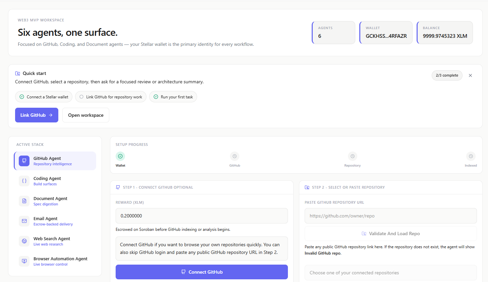
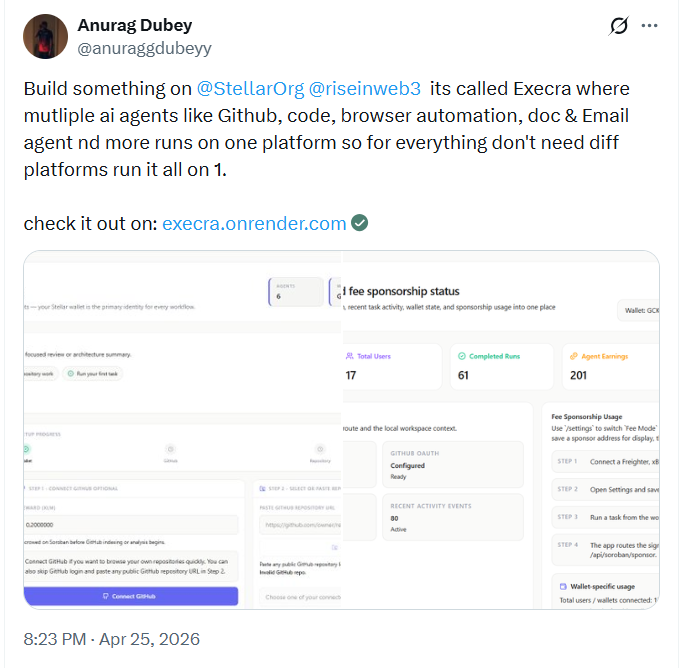

# Execra

> A wallet-first multi-agent workspace built on Stellar and Soroban.

Execra lets users connect a Stellar wallet, run focused AI agent workflows, and track escrow-backed task execution on-chain.  
The featured advanced capability in this version is **Fee Sponsorship**, where user-signed Soroban transactions are relayed through a sponsor-paid fee bump flow.

## Live Link

[Open Execra](https://execra6.vercel.app)

## Video Demo
[Video Demo](https://drive.google.com/file/d/1UlANTTOKPK3bu8j2Bnh0_d_xY3OQfL0B/view?usp=sharing)

## At a Glance

| Area | Details |
| --- | --- |
| Frontend | Next.js 16, React 19, TypeScript |
| Backend | Supabase, Next.js API routes |
| Blockchain | Soroban / Stellar SDK |
| AI | OpenRouter / OpenAI-compatible models |
| Automation | Playwright |
| Contract | Rust |

## Deployment Note For Browser Automation

The browser agent runs Playwright on the server. For deployments, Chromium must be installed at build time and bundled with the app. This repo does that via the `postinstall` script in `package.json`, which runs:

`node scripts/installPlaywrightBrowsers.mjs`

That script sets `PLAYWRIGHT_BROWSERS_PATH=0` and installs Chromium so the deployed runtime can find the browser binary.

## Basic CI

GitHub Actions runs CI on pull requests and pushes to `main` / `master`.

Current checks:

- `npm ci`
- `npm run lint`
- `npm run build`
- `cargo test` in `contracts/task_escrow`

## Technical Documentation

- `app/`: frontend pages and API routes
- `components/`: reusable UI
- `lib/`: shared logic, services, wallet flow, Soroban integration
- `contracts/task_escrow/`: Soroban smart contract
- `supabase/`: schema and migrations

## User Guide

1. Open the live app and connect a Stellar wallet.
2. Go to `/settings` and enable `Sponsored Fee Bump` if you want sponsored fees.
3. Open `/agents` and run a task.
4. Review execution history in `/activity`.
5. Use `/dashboard` for metrics and monitoring proof.

## User Feedback

Execra has been tested with **30+ testnet users**.

- [Feedback Sheet](https://docs.google.com/spreadsheets/d/1m6TaHdlt-Aq-8KD_0iVJUwQH0wSc6tWdmSN2C3pYl3Q/edit?usp=sharing)
- [Stellar Explorer](https://stellar.expert/explorer/testnet)

## Submission Proof

### Metrics Dashboard

- [Live Metrics Dashboard](https://execra6.vercel.app/dashboard)


### Monitoring Dashboard

- [Live Monitoring View](https://execra6.vercel.app/api/platform-status)




### Security Checklist

- [Completed Security Checklist](./docs/security-checklist.md)

### Community Contribution

- [Twitter post link](https://x.com/anuraggdubeyy/status/2048052847737184593?s=20)

## Advanced Feature

### Fee Sponsorship

**Description**

User-signed Soroban task transactions are sent through `/api/soroban/sponsor`, where the configured sponsor account wraps the signed transaction in a fee bump and submits it to Stellar testnet.

**Proof of Implementation**

- UI configuration: [`app/settings/page.tsx`](./app/settings/page.tsx)
- Feature normalization: [`lib/taskFeatures.ts`](./lib/taskFeatures.ts)
- Sponsor route: [`app/api/soroban/sponsor/route.ts`](./app/api/soroban/sponsor/route.ts)
- Soroban client flow: [`lib/soroban/taskEscrowClient.ts`](./lib/soroban/taskEscrowClient.ts)
- Metrics page: [`app/dashboard/page.tsx`](./app/dashboard/page.tsx)

## Project Structure

```text
Execra6/
├─ .github/
│  └─ workflows/
├─ app/
│  ├─ agents/
│  ├─ activity/
│  ├─ dashboard/
│  ├─ settings/
│  └─ api/
├─ components/
├─ contracts/
│  └─ task_escrow/
├─ docs/
├─ lib/
├─ Screenshots/
├─ supabase/
├─ types/
├─ package.json
├─ next.config.ts
├─ server.mjs
└─ README.md
```
