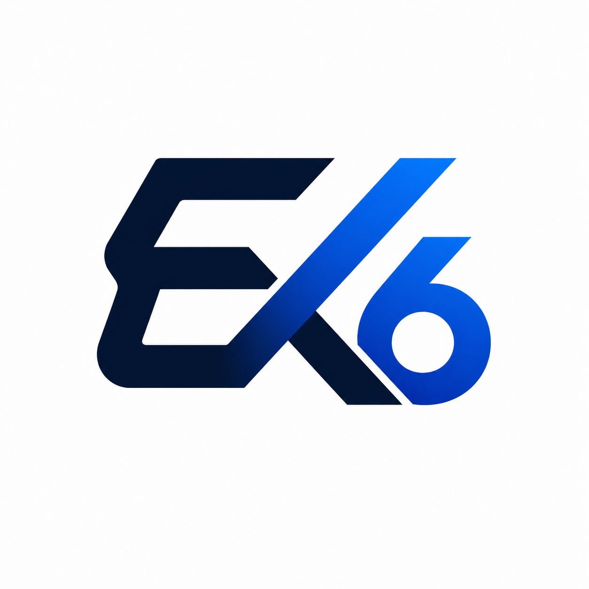

<p align="center">
  
</p>

<h1 align="center">Execra</h1>

<p align="center">
  <strong>Wallet-first multi-agent workspace on Stellar & Soroban</strong>
</p>

<p align="center">
  <a href="https://execra6.vercel.app"></a>
  <a href="https://drive.google.com/file/d/1UlANTTOKPK3bu8j2Bnh0_d_xY3OQfL0B/view?usp=sharing"></a>
</p>

<p align="center">
  
  
  
  
  
  
  
</p>

---

## ✨ What is Execra?

Execra is an **escrow-backed AI agent platform** where every task runs through a Soroban smart contract on the Stellar testnet. Connect your wallet, pick an agent, and execute — with on-chain proof for every action.

The advanced feature in this version is **Fee Sponsorship**: user-signed Soroban transactions are relayed through a sponsor-paid fee bump flow, removing the gas cost barrier for end users.

---

## 🤖 Six Agents, One Surface

| Agent | What it does |
|:---:|:---|
| 🐙 **GitHub** | Connect repos, index source code, review architecture & generate focused summaries |
| 💻 **Coding** | Generate MVP-ready code artifacts with live preview & downloadable bundles |
| 📄 **Document** | Parse PDFs, CSVs, JSON files into concise analysis your team can act on |
| 📧 **Email** | Draft and send escrow-backed emails through a configured mailbox |
| 🔍 **Web Search** | Run live web research with source-backed summaries and related content |
| 🌐 **Browser** | Control a visible browser session and stream live execution logs |

---

## 📸 Screenshots

<p align="center">
  
  <br/>
  <em>Agent workspace — clean, focused, minimal</em>
</p>

<p align="center">
  
  <br/>
  <em>Dashboard — platform metrics & task monitoring</em>
</p>

---

## 🏗️ Tech Stack

```
Frontend       Next.js 16 · React 19 · TypeScript 5
Styling        Tailwind CSS 4 · Custom design tokens
Backend        Supabase · Next.js API routes · Express
Blockchain     Soroban smart contracts · Stellar SDK 14
AI Engine      OpenRouter / OpenAI-compatible models
Automation     Playwright (server-side Chromium)
Contract       Rust (task_escrow)
```

---

## 🚀 Quick Start

```bash
# Clone
git clone https://github.com/anuraggdubey/Execra6.git
cd Execra6

# Install
npm install

# Configure environment
cp .env.local.example .env.local
# → Fill in Supabase, OpenRouter, Stellar keys

# Run
npm run dev
```

Open [http://localhost:3000](http://localhost:3000) and connect a Stellar testnet wallet.

---

## 🔐 Advanced Feature — Fee Sponsorship

> User-signed Soroban transactions are wrapped in a sponsor-paid fee bump and submitted to Stellar testnet — **zero gas costs for end users**.

**How it works:**

```
User signs tx  →  POST /api/soroban/sponsor  →  Sponsor wraps in fee bump  →  Submitted to testnet
```

**Key files:**

| File | Purpose |
|:---|:---|
| [`app/settings/page.tsx`](./app/settings/page.tsx) | UI toggle for fee sponsorship |
| [`lib/taskFeatures.ts`](./lib/taskFeatures.ts) | Feature flag normalization |
| [`app/api/soroban/sponsor/route.ts`](./app/api/soroban/sponsor/route.ts) | Sponsor relay endpoint |
| [`lib/soroban/taskEscrowClient.ts`](./lib/soroban/taskEscrowClient.ts) | Soroban client integration |
| [`app/dashboard/page.tsx`](./app/dashboard/page.tsx) | Sponsorship metrics |

---

## 📁 Project Structure

```
Execra6/
├── .github/workflows/     CI pipeline
├── app/
│   ├── agents/            Agent workspace
│   ├── activity/          Execution history
│   ├── dashboard/         Metrics & monitoring
│   ├── settings/          Fee sponsorship config
│   └── api/               Backend routes
├── components/
│   ├── agents/            Agent-specific UI
│   ├── landing/           Landing page sections
│   ├── layout/            Navbar, shell, logo
│   ├── wallet/            Wallet connection
│   └── workspace/         Shared workspace UI
├── contracts/
│   └── task_escrow/       Soroban smart contract (Rust)
├── lib/
│   ├── soroban/           On-chain integration
│   └── wallet/            Wallet providers & session
├── supabase/              Schema & migrations
└── types/                 Shared TypeScript types
```

---

## 🧪 CI Pipeline

GitHub Actions runs on PRs and pushes to `main`:

```
npm ci  →  npm run lint  →  npm run build  →  cargo test (contracts/task_escrow)
```

---

## 📋 User Guide

| Step | Action |
|:---:|:---|
| **1** | Open the [live app](https://execra6.vercel.app) and connect a Stellar wallet |
| **2** | Go to `/settings` and enable **Sponsored Fee Bump** if desired |
| **3** | Open `/agents` and run any agent task |
| **4** | Review execution history in `/activity` |
| **5** | Check `/dashboard` for metrics and on-chain proof |

---

## 👥 User Feedback

Tested with **30+ testnet users**.

<p>
  <a href="https://docs.google.com/spreadsheets/d/1m6TaHdlt-Aq-8KD_0iVJUwQH0wSc6tWdmSN2C3pYl3Q/edit?usp=sharing"></a>
  <a href="https://stellar.expert/explorer/testnet"></a>
</p>

---

## 🌍 Community

<p>
  <a href="https://x.com/anuraggdubeyy/status/2048052847737184593?s=20"></a>
</p>

<p align="center">
  
</p>

---

## 📝 Security

- [Completed Security Checklist](./docs/security-checklist.md)

---

## ⚙️ Deployment Note

The browser agent runs Playwright on the server. Chromium is installed at build time via the `postinstall` script:

```bash
node scripts/installPlaywrightBrowsers.mjs
# Sets PLAYWRIGHT_BROWSERS_PATH=0 and installs Chromium
```

---

<p align="center">
  <sub>Built with 🤍 on Stellar · Powered by Soroban smart contracts</sub>
</p>
