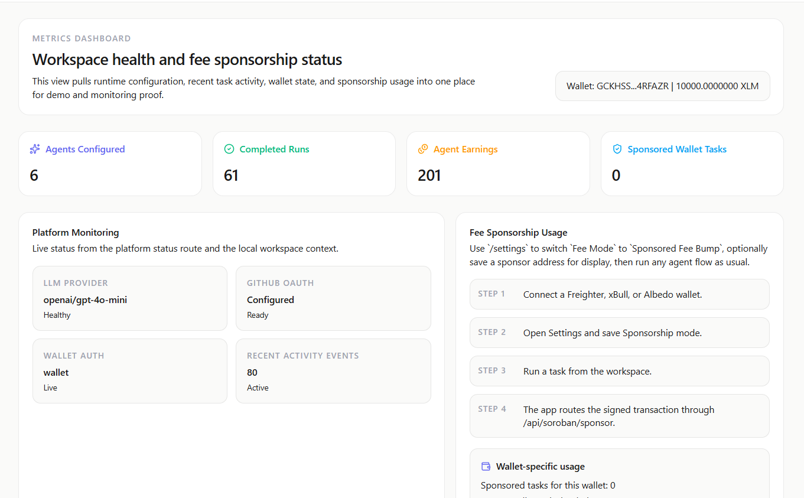
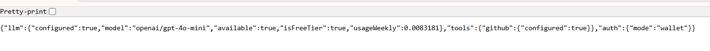

# Execra

Execra is a wallet-first multi-agent workspace built on Stellar/Soroban. Users connect a Stellar wallet, run AI agent workflows, and track escrow-backed task execution on-chain. The advanced feature kept in this version is `Fee Sponsorship`, where user-signed Soroban transactions are relayed through a sponsor-paid fee bump flow.

## Live Demo

- https://execra6-ai.vercel.app

## Project Stack

- Next.js 16
- React 19
- TypeScript
- Supabase
- Soroban / Stellar SDK
- OpenRouter / OpenAI-compatible models
- Playwright
- Rust for the Soroban contract

## Basic CI

GitHub Actions runs a basic CI workflow on pull requests and pushes to `main` / `master`.

It currently checks:

- `npm ci`
- `npm run lint`
- `npm run build`
- `cargo test` for `contracts/task_escrow`

## Technical Documentation

- Frontend app routes live in `app/`
- reusable UI components live in `components/`
- shared logic and Soroban integration live in `lib/`
- smart contract source lives in `contracts/task_escrow/`
- database schema and migrations live in `supabase/`

## User Guide

1. Open the live app and connect a Stellar wallet.
2. Go to `/settings` and enable `Sponsored Fee Bump` if you want fee sponsorship.
3. Open `/agents` and run an agent task.
4. Track task results in `/activity`.
5. Review overall status and proof screens in `/dashboard`.

## User Feedback

We collected feedback from 30+ testnet users.

- [View Feedback Sheet](https://docs.google.com/spreadsheets/d/1m6TaHdlt-Aq-8KD_0iVJUwQH0wSc6tWdmSN2C3pYl3Q/edit?usp=sharing)

Check any address on Stellar Explorer:

- https://stellar.expert/explorer/testnet

## Submission Proof

### Metrics Dashboard

- Link: [Metrics Dashboard](https://execra6-ai.vercel.app/dashboard)
- Screenshot:



### Monitoring Dashboard

- Link: [Monitoring Dashboard](https://execra6-ai.vercel.app/api/platform-status)
- Screenshot:



### Security Checklist

- [Completed security checklist](./docs/security-checklist.md)

### Community Contribution

- Twitter post link to add later: `https://twitter.com/your-handle/status/your-post-id`

## Advanced Feature

### Fee Sponsorship

Description:
User-signed Soroban task transactions can be routed through `/api/soroban/sponsor`, where the configured sponsor account wraps the signed transaction in a fee bump and submits it to Stellar testnet.

Proof of implementation:

- UI config: [`app/settings/page.tsx`](./app/settings/page.tsx)
- Feature normalization: [`lib/taskFeatures.ts`](./lib/taskFeatures.ts)
- Sponsor route: [`app/api/soroban/sponsor/route.ts`](./app/api/soroban/sponsor/route.ts)
- Soroban client flow: [`lib/soroban/taskEscrowClient.ts`](./lib/soroban/taskEscrowClient.ts)
- Metrics proof page: [`app/dashboard/page.tsx`](./app/dashboard/page.tsx)

## Project Structure

```text
Execra6/
├─ .github/
│  └─ workflows/
├─ app/
│  ├─ agents/
│  ├─ activity/
│  ├─ dashboard/
│  ├─ settings/
│  └─ api/
├─ components/
├─ contracts/
│  └─ task_escrow/
├─ docs/
├─ lib/
├─ Screenshot/
├─ supabase/
├─ types/
├─ package.json
├─ next.config.ts
├─ server.mjs
└─ README.md
```
