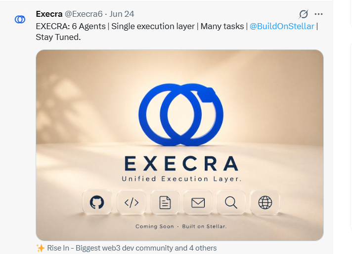
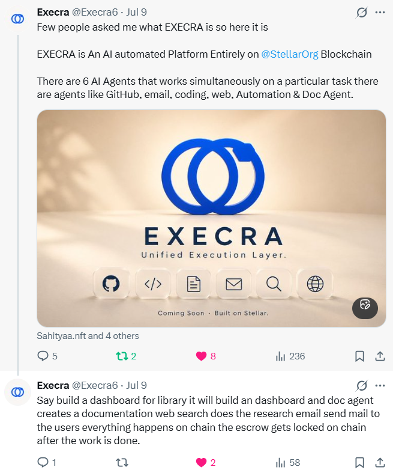
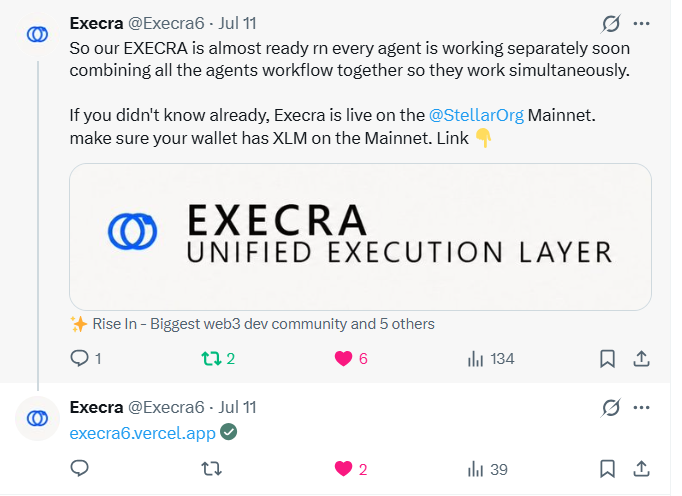
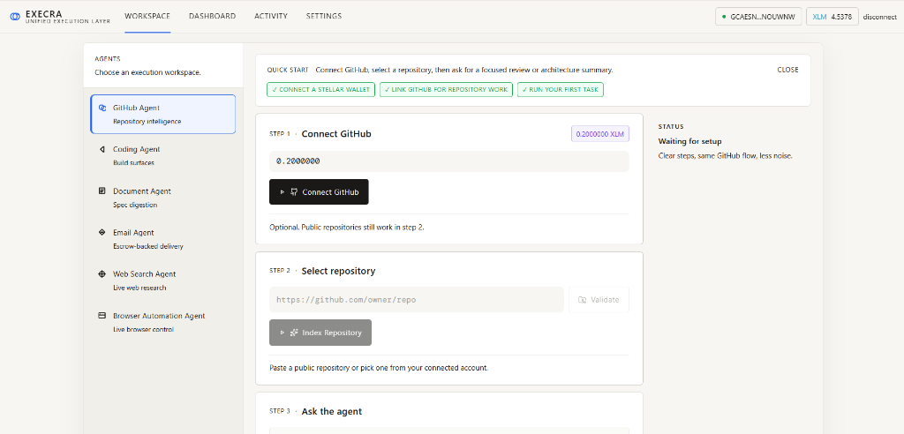
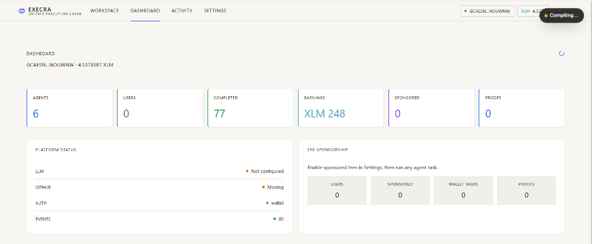

<!-- Execra Documentation -->
<h1 align="center">Execra</h1>

<p align="center">
  <strong>Wallet-first multi-agent workspace on Stellar & Soroban</strong>
</p>

<p align="center">
  <a href="https://execra6.vercel.app"></a>
  <a href="https://drive.google.com/file/d/132Ytp7MAAFrD0tT_ImFpnWWJR07I_voK/view?usp=drive_link"></a>
  <a href="https://github.com/anuraggdubey/Execra6/blob/main/Execra6%20Documentation.md"></a>
  <a href="https://x.com/Execra6"></a>
</p>

<p align="center">
  
  
  
  
  
  
  
</p>

---

## What is Execra?

Execra is an **escrow-backed AI agent platform** where every task runs through Soroban smart contracts on Stellar Mainnet. Connect your wallet, pick an agent, and execute with on-chain escrow and proof tracking for every action.

The platform is wallet-first: task payments are created from the connected user's wallet, while optional fee sponsorship can be enabled only when a separate sponsor account is configured.

---

## Six Agents, One Surface

| Agent | What it does |
|:---:|:---|
| **GitHub** | Connect repos, index source code, review architecture, and generate focused summaries |
| **Coding** | Generate MVP-ready code artifacts with live preview and downloadable bundles |
| **Document** | Parse PDFs, CSVs, JSON files into concise analysis your team can act on |
| **Email** | Draft and send escrow-backed emails through a configured mailbox |
| **Web Search** | Run live web research with source-backed summaries and related content |
| **Browser** | Control a visible browser session and stream live execution logs |

---

## User Feedback

Tested with **40+ early users**

**[User Feedback Sheet (Google Sheets)](https://docs.google.com/spreadsheets/d/1m6TaHdlt-Aq-8KD_0iVJUwQH0wSc6tWdmSN2C3pYl3Q/edit?usp=sharing)**

---

## Community & Updates

<p align="center">
  <a href="https://x.com/Execra6"></a>
  <a href="https://github.com/anuraggdubey/Execra6/commits/main/"></a>
  <a href="https://github.com/anuraggdubey/Execra6/blob/main/Execra6%20Documentation.md"></a>
</p>

### 📢 Official Social Media & Product Update Posts

Follow our official channel on X ([@Execra6](https://x.com/Execra6)) for live announcements, architecture breakdowns, and product releases:

---

#### 🔹 Update 1: 6 Autonomous Agents on a Single Stellar Execution Layer
> *"EXECRA: 6 Agents | Single execution layer | Many tasks | @BuildOnStellar | Stay Tuned."*  
> 🔗 **Post Link:** [View on X (Post #1)](https://x.com/Execra6/status/2069684652496028027?s=20)

<p align="center">
  <a href="https://x.com/Execra6/status/2069684652496028027?s=20">
    
  </a>
</p>

---

#### 🔹 Update 2: What is Execra? Autonomous Multi-Agent Workspace
> *"EXECRA is an AI automated platform entirely on Stellar blockchain with 6 simultaneous AI agents and on-chain escrow lockup."*  
> 🔗 **Post Link:** [View on X (Post #2)](https://x.com/Execra6/status/2075195010790952990?s=20)

<p align="center">
  <a href="https://x.com/Execra6/status/2075195010790952990?s=20">
    
  </a>
</p>

---

#### 🔹 Update 3: Live on Stellar Mainnet
> *"Execra is live on the Stellar Mainnet with autonomous agent workflows and wallet-first escrow settlement."*  
> 🔗 **Post Link:** [View on X (Post #3)](https://x.com/Execra6/status/2075859737321603462?s=20)

<p align="center">
  <a href="https://x.com/Execra6/status/2075859737321603462?s=20">
    
  </a>
</p>

---

### 🛠️ Continuous Product Improvement & Commits

Track ongoing development, protocol upgrades, and agent optimizations directly on GitHub:

- 🚀 **Live Commit History & Product Improvements:** [github.com/anuraggdubey/Execra6/commits/main/](https://github.com/anuraggdubey/Execra6/commits/main/)
- 📖 **Comprehensive System Documentation:** [Execra6 Documentation.md](./Execra6%20Documentation.md) | [Online GitHub View](https://github.com/anuraggdubey/Execra6/blob/main/Execra6%20Documentation.md)
- 💬 **Creator Post:** [X Post by @anuraggdubeyy](https://x.com/anuraggdubeyy/status/2048052847737184593?s=20)

---

## Platform Features

- Stellar Mainnet escrow for agent tasks through Soroban contracts
- On-chain proof submission and task status sync
- Wallet support for Freighter, xBull, and Albedo
- Supabase-backed users, task history, agent runs, and dashboard metrics
- GitHub OAuth flow for repository analysis
- Live browser automation sessions with streamed progress events
- Generated code previews and downloadable project bundles
- Optional fee sponsorship flow for deployments that choose to subsidize network fees

---

## Mainnet Contracts

| Contract | Address |
|:---|:---|
| Agent Registry | `CAVJ7EW6WBZN6VKU7TVRJYTOL7RZ3DNZC2NQEAWMILLXMIFJ2FRHV2QC` |
| Task Escrow | `CAUTH4R5HX44DS45W24HCZOPUE6LXA3DU6EKQU32IOB6QZ3AKZ4YE43O` |
| Task Proof | `CCBEH4ERGUYIUA44MOFPGZH67LD7MK7KFK6DDZL4FEIR2CPGDXISD3PQ` |
| Native XLM SAC | `CAS3J7GYLGXMF6TDJBBYYSE3HQ6BBSMLNUQ34T6TZMYMW2EVH34XOWMA` |

Network: Stellar Mainnet  
RPC: `https://rpc.lightsail.network`  
Deployer: `GCBUI4DWP2ILEL4QHANJUGE3B5KGEJ2SQIL65I2X44EUXIGL7WJ532WD`

---

## Screenshots

<p align="center">
  
  <br/>
  <em>Agent workspace - clean, focused, minimal</em>
</p>

<p align="center">
  
  <br/>
  <em>Dashboard - platform metrics and task monitoring</em>
</p>

---

## Tech Stack

```
Frontend       Next.js 16 / React 19 / TypeScript 5
Styling        Tailwind CSS 4 / Custom design tokens
Backend        Supabase / Next.js API routes / Express
Blockchain     Soroban smart contracts / Stellar SDK 14
AI Engine      OpenRouter / OpenAI-compatible models
Automation     Playwright server-side Chromium
Contracts      Rust: agent_registry / task_escrow / task_proof
```

---

## Quick Start

```bash
# Clone
git clone https://github.com/anuraggdubey/Execra6.git
cd Execra6

# Install
npm install

# Configure environment
# Fill in Supabase, AI/search, GitHub OAuth, email, and Stellar Mainnet keys

# Run
npm run dev
```

Open [http://localhost:3001](http://localhost:3001) and connect a Stellar Mainnet wallet.

---

## Advanced Feature - Fee Sponsorship

> User-signed Soroban transactions can be wrapped in a sponsor-paid fee bump and submitted to Stellar Mainnet when a sponsor account is configured.

**How it works:**

```
User signs tx -> POST /api/soroban/sponsor -> Sponsor wraps in fee bump -> Submitted to mainnet
```

**Key files:**

| File | Purpose |
|:---|:---|
| [`app/settings/page.tsx`](./app/settings/page.tsx) | UI toggle for fee sponsorship |
| [`lib/taskFeatures.ts`](./lib/taskFeatures.ts) | Feature flag normalization |
| [`app/api/soroban/sponsor/route.ts`](./app/api/soroban/sponsor/route.ts) | Sponsor relay endpoint |
| [`lib/soroban/taskEscrowClient.ts`](./lib/soroban/taskEscrowClient.ts) | Soroban client integration |
| [`app/dashboard/page.tsx`](./app/dashboard/page.tsx) | Sponsorship metrics |

---

## Project Structure

```
Execra6/
├── .github/workflows/     CI pipeline
├── app/
│   ├── agents/            Agent workspace
│   ├── activity/          Execution history
│   ├── dashboard/         Metrics and monitoring
│   ├── settings/          Fee sponsorship config
│   └── api/               Backend routes
├── components/
│   ├── agents/            Agent-specific UI
│   ├── landing/           Landing page sections
│   ├── layout/            Navbar, shell, logo
│   ├── wallet/            Wallet connection
│   └── workspace/         Shared workspace UI
├── contracts/
│   ├── agent_registry/    Soroban registry contract
│   ├── task_escrow/       Soroban escrow contract
│   └── task_proof/        Soroban proof contract
├── lib/
│   ├── soroban/           On-chain integration
│   └── wallet/            Wallet providers and session
├── supabase/              Schema and migrations
└── types/                 Shared TypeScript types
```

---

## CI Pipeline

GitHub Actions runs on PRs and pushes to `main`:

```
npm ci -> npm run lint -> npm run build -> cargo test (contracts/task_escrow)
```

---

## User Guide

| Step | Action |
|:---:|:---|
| **1** | Open the [live app](https://execra6.vercel.app) and connect a Stellar wallet |
| **2** | Open `/agents` and run any agent task |
| **3** | Review execution history in `/activity` |
| **4** | Check `/dashboard` for metrics and on-chain proof |
| **5** | Use `/settings` only if fee sponsorship is configured for the deployment |

---

## Security

- [Completed Security Checklist](./docs/security-checklist.md)

---

## Deployment Note

The browser agent runs Playwright on the server. Chromium is installed at build time via the `postinstall` script:

```bash
node scripts/installPlaywrightBrowsers.mjs
# Sets PLAYWRIGHT_BROWSERS_PATH=0 and installs Chromium
```

---

<p align="center">
  <sub>Built on Stellar / Powered by Soroban smart contracts</sub>
</p>
